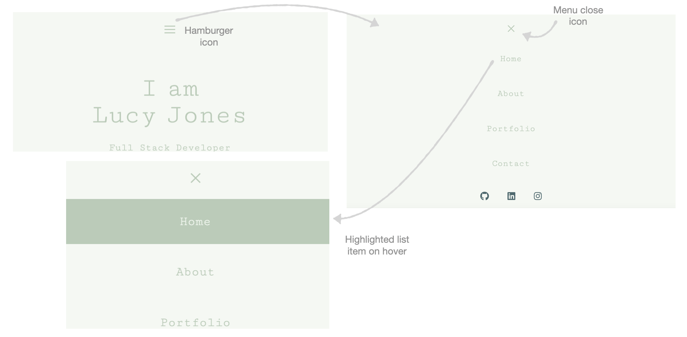
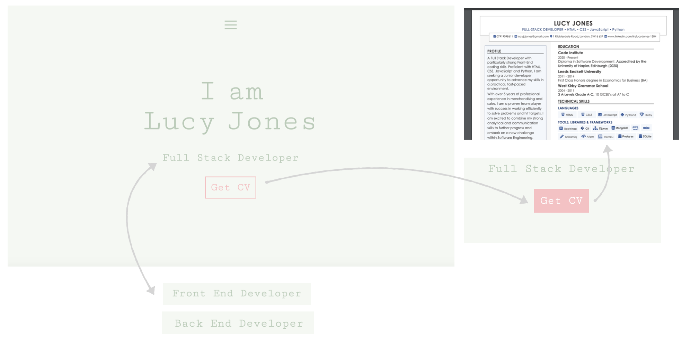
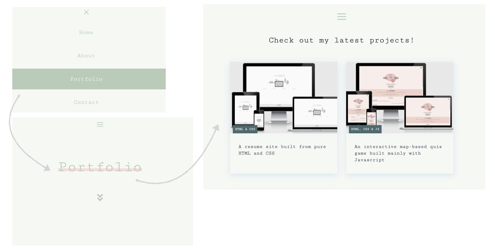
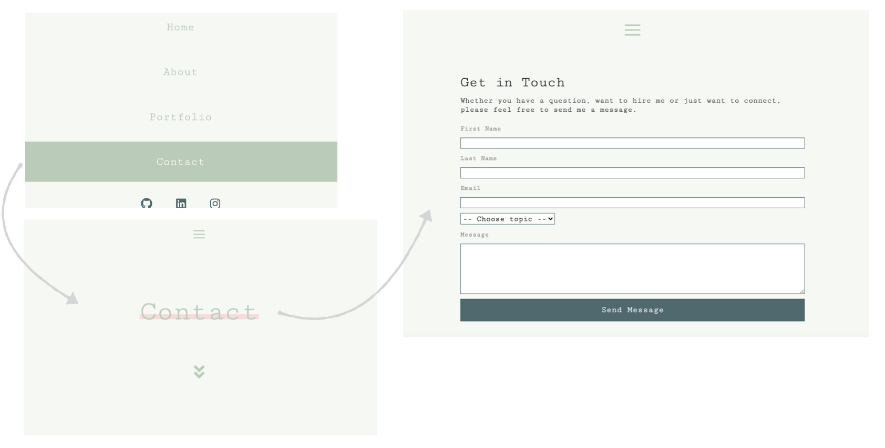
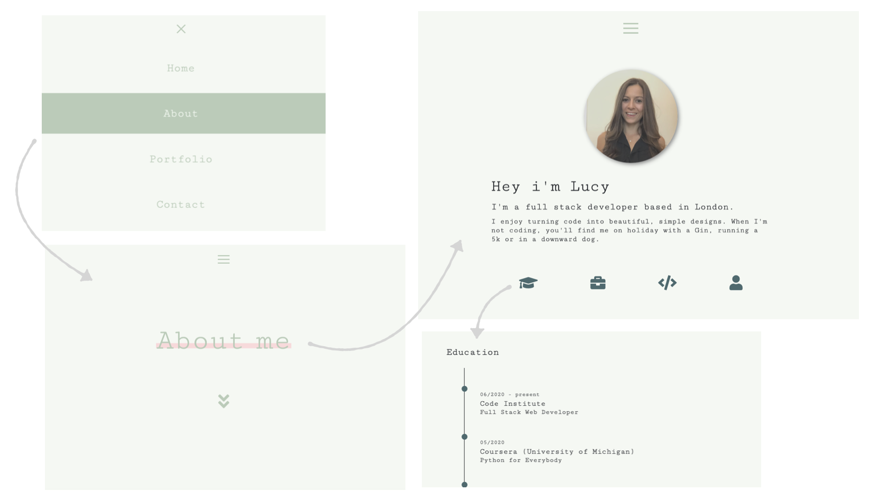
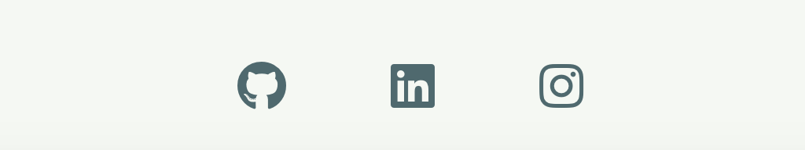

<div align="center">
  
  
<hr>

**A custom site built to present my skills, completed projects, education and previous work experience to potential employers and clients.**

This app was built using [VScode](https://code.visualstudio.com/) and deployed to [GitHub](https://pages.github.com/).

[Check me out](https://lucyjpjones.github.io/lj-online-resume/)

</div>

---

## <u>Table of contents</u>

**<details><summary> User Experience (UX)</summary>**
  - [Purpose](#purpose)
  - [Design](#design)
  - [User stories](#user-stories)
  - [Wireframes](#wireframes)
</details>

**<details><summary> Features</summary>**
  - [Features used](#features-used)
  - [To do list](#to-do-list)
  - [Status](#status)
</details>

**<details><summary> Technologies</summary>**
  - [Languages](#languages)
  - [Frameworks, Libraries & Programs](#frameworks-libraries-programs)
</details>

**<details><summary> Deployment</summary>**
  - [Deploy to Heroku](#deploy-to-heroku)
  - [Accessing code](#accessing-code)
</details>

**<details><summary> Testing</summary>**
  - [Testing Documentation](https://github.com/Lucyjpjones/wean-cuisine/blob/master/testing.md)
</details>

**<details><summary> Credits</summary>**
  - [Content](#content)
  - [Media](#media)
  - [Acknowledgements](#acknowledgements)
</details>

**<details><summary> Contact</summary>**
  - [Contact details](#contact-details) 
</details>
---

# &rarr; **User Experience (UX)**

### **<u>Purpose</u>**

The purpose of this project is to create an online presence for myself whilst developing my experience using **React** and **Node JS**. My main goal is to get myself noticed and increase my chances of getting hired.

The online resume will aim to give users proof of my ability and confidence in what I can do.

### **<u>Design</u>**

**Structure**

- A simple design structure with a sticky navbar and full screen view navigation menu accessible from every page. 

**Colour scheme**
- A simple colour scheme to keep the design looking clean and elegant.
- A pale background used throughout the site to avoid any visual obstacles and helping add visual emphasis to other important parts of the design. It is also easier on the eye than a classic white.
- I created my final palette using [Coolors](https://coolors.co).


**Typography**
- 'Cutive Mono' has been used as the main font used throughout the website with Sans Serif as the fallback font if for any reason the font isn't being imported into the site correctly. It is a classic typewriter typeface used frequently in programming, so it is both attractive and appropriate.


#### User stories

The <u>key priorities</u> for my user are as follows:

1. To be able to easily navigate throughout the site to find the desired content.

2. Ability to access a hard copy of my CV.

3. To view my portfolio of work.

4. Ability to contact me.

5. View my current skills and experience.

6. Access links to my external social accounts.
                |
## &rarr; **Features**

### **Features used**

- **Responsive on all device sizes**
  - Responsive on all devices through using React Bootstrap and CSS media queries.

- **A user-friendly interface with easy navigation throughout the site**
  - Attractive, minimalistic design with visuals and information presented clearly and concisely.

  - Easily readable fonts and simple navigation throughout the site.
    - Fixed navigation bar visible on every page.

  - An aesthetically pleasing 404 page if the user is directed to a non-existent page.

- **Buttons**
    - Stand out interactive button to download CV

- **Form**
  - An EmailJS contact form with submit button for users to easily get in touch via my website.
  - The form has been set up to ensure all fields are filled out and that the email is written in the correct format

- **Timeline**
  - Education and work history presented in a timeline to provide a clear summary of my experience.

- **Progress bars**
  - Progress bars used to visually represent my personal skills.

- **Tabs**
  - Icon interactive tab used to allow the user to switch between resume information.

- **Card Listings**
  - Used to display my projects.
  - Image included contributing to the visual look.

- **External links to social platforms**
  - Recognisable icons with links to my external social platforms.

---

## &rarr; **Technologies**

#### Languages

- [HTML5](https://en.wikipedia.org/wiki/HTML5)
- [CSS3](https://en.wikipedia.org/wiki/Cascading_Style_Sheets)
- [JavaScript](https://www.javascript.com/)

#### Frameworks, Libraries & Programs

- [**React**](https://reactjs.org/)
  - An open-source JavaScript library used for building the user interface.

- [**React Bootstrap**](https://react-bootstrap.github.io/)
  - Used to assist with the responsiveness and styling of the website using design components.

- [**Google fonts**](https://fonts.google.com/)
  - Google fonts were used to import the fonts into the CSS file which is used on all pages throughout the project.

- [**Font Awesome 4.7.0**](https://fontawesome.com/)
  - Font Awesome was used to add icons for aesthetic and UX purposes.

- [**VScode**](https://code.visualstudio.com/)
  -  Code editor used for building web application.

- [**GitHub**](https://github.com/)

  - GitHub is the hosting platform used to store the project code.

- [**HTML Formatter**](https://www.freeformatter.com/html-formatter.html) and [**CSS Formatter**](https://www.freeformatter.com/css-beautifier.html)

  - Used to format my HTML and CSS file with the desired indentation level for optimal readability.
    
---

## &rarr; **Deployment**

#### Deploy to Github

The project was deployed to GitHub Pages using the following steps...

#### Accessing code


  Follow the steps below if you are wanting to propose changes to the project or to use the project as a starting point for your own idea.


- **Forking the GitHub Repository**

  Forking allows you to create a copy of the original repository and propose changes to the repository owner via a pull request. 

    1. Log in to GitHub and locate the GitHub Repository
    
    2. At the top of the Repository (not top of page) just above the "Settings" button on the menu, locate the "Fork" button.

    
    
    3. You should now have a copy of the original repository in your GitHub account.

- **Making a Local Clone**

When you clone a repository, the repository is copied on to your local machine.

  1. Log in to GitHub and locate the GitHub Repository.

  2. Under the repository name, click the "download code" option.

  

  3. To clone the repository using HTTPS, under "Clone with HTTPS", copy the link.

  

  4. Open Git Bash

  5. Change the current working directory to the location where you want the cloned directory to be made.

  6. Type git clone, and then paste the URL you copied in Step 3. 
  ```
  $ git clone https://github.com/YOUR-USERNAME/lj-online-resume.git
  ```

  7.	Press Enter. Your local clone will be created.
    
  ```
  $ git clone https://github.com/YOUR-USERNAME/lj-online-resume.git

  > Cloning into `lj-online-resume`...
  > remote: Enumerating objects: 299, done.
  > remote: Counting objects: 100%, (299/299),  done.
  > remote: Compressing objects: 100% (156/156), done.
  > Recieving objects: remove: Total 299 (delta 145), reused 267 (delta 126), pack-reused 0
  > Recieving objects: 100% (299/299), 4.61MiB | 2.98 MiB/s, done.
  > Resolving deltas: 100% (145/145), done. Unpacking objects: 100% (10/10), done.
  ```

Now, you have a local copy of your fork of the lj-online-resume repository.

> Note: The repository name and output numbers that you see on your computer, representing the total file size, etc, may differ from the example I have provided above.

---

## &rarr; **Testing**

#### Testing user stories
 Testing my user's <u>key priorities</u>:

1. **To be able to easily navigate throughout the site to find the desired content**
- Upon entering the site, users are automatically greeted with a simple structured homepage 
-  The header features a hamburger menu icon which triggers a full page naviagtion menu.

    

2. **Ability to access a hard copy of my CV**
- 'CV' link on the homepage which is a direct link to download a hard copy of my CV.
- Opens up my CV in a new tab in the browser so the user won't lose their place on the site.

    

3. **To view my portfolio of work**
- 'Portfolio' link on menu to access the page with my latest projects.
- Cards used to display projects including image, information and label with featuring languages used.
- Each project links to full project in Github, opened on a new tab. 

    

4. **Ability to contact me**
- 'Contact' link on the menu bar to page with EmailJS contact form.

    

5. **View my current skills and experience**
- 'About me' link on the menu bar to access a page with my current skills and experience.

    

- This can also be found on the hard copy of CV.

6. **Access links to my external social accounts**
- Social platform icons are displayed at the bottom of the navigation menu linking to the appropriate sites.

    

#### Validator checks

#### Responsive Design

- Viewport tag included in the head of HTML files to tell the browser how to respond to different resolutions, particularly mobile ones.

- Media queries used in the CSS file to target larger devices.

#### Additional Testing

#### Bugs

| | Bug                                                  | Action                                           |
|-----------|------------------------------------------------------|--------------------------------------------------|
| [ ]       | 1 | 11  |
| [ ]       | 2 | 22 |
| [ ]       | 3 | 33 |

---
## &rarr; **Credits**

#### Content


#### Media


#### Acknowledgments

---

## &rarr; **Contact**

#### Contact details

Created by @lucyjpjones

If you have any problems, questions or, suggestions for my project please contact me on the email below:

```
lucyjpjones@gmail.com
```

Thanks for visiting.

&copy;
LucyJPJones